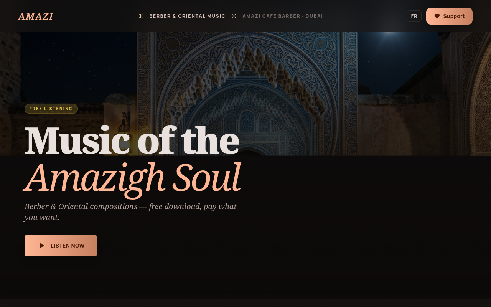
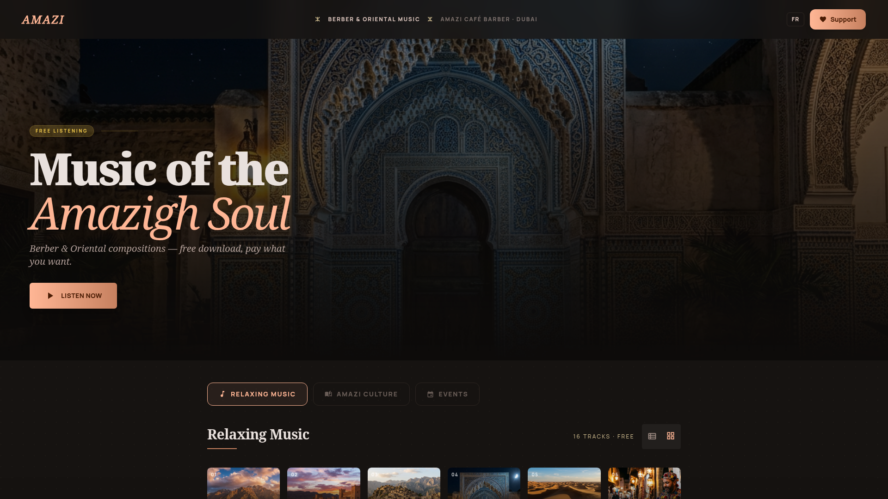
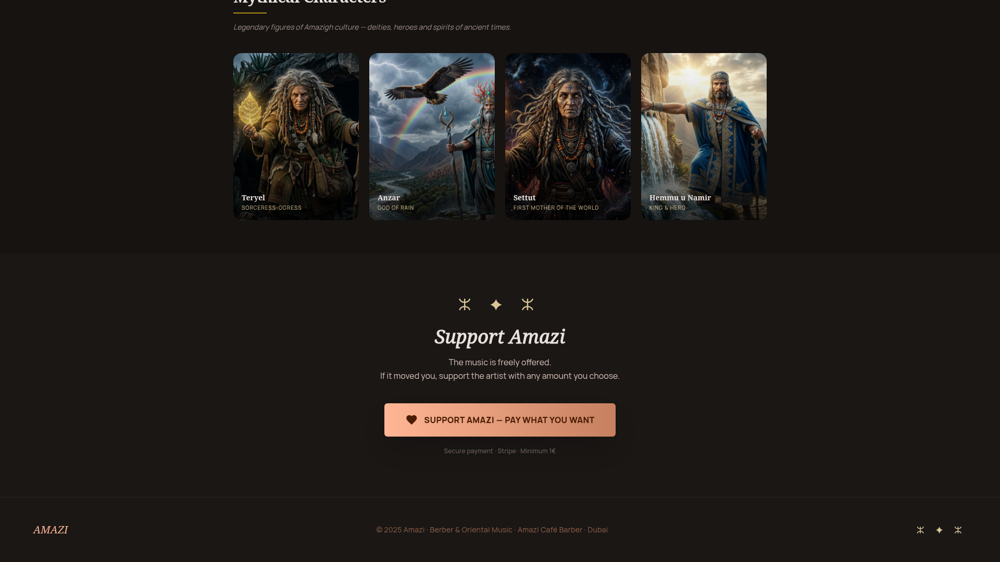
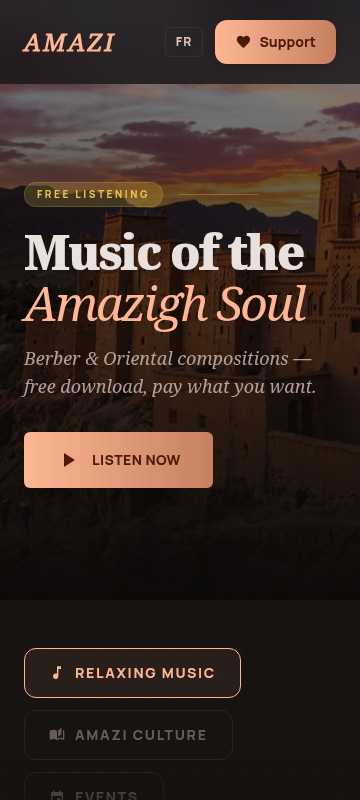

# Amazi Music

Site vitrine dédié à la musique amazighe — culture berbère, musique de détente, événements et personnages mythiques.

🌐 **Live** : [amazimusic.fr](https://amazimusic.fr)

## Screenshots

| Hero | Onglets & Titres |
|------|-----------------|
|  |  |

| Personnages Mythiques | Mobile |
|----------------------|--------|
|  |  |

## Stack

| Technologie | Usage |
|-------------|-------|
| HTML5 / CSS3 | Structure et styles |
| Tailwind CSS | Design utilitaire |
| JavaScript vanilla | Player audio, animations, navigation |
| Gemini API | Génération de covers IA |
| Stripe | Dons / soutien (montant libre) |

## Fonctionnalités

- **Player audio** — 16 titres Musique Détente avec slideshow hero
- **Culture Amazi** — Pistes bilingues FR/Tamazight (switch audio en temps réel)
- **Personnages Mythiques** — Teryel, Anzar, Settut, Hemmu avec fiches lightbox
- **Vidéo Anzar** — Embed YouTube intégré dans la fiche personnage
- **Événements** — Agenda culturel amazigh
- **Covers IA** — Générées avec Gemini `gemini-3.1-flash-image-preview`
- **Responsive** — Mobile first, bouton ✕ fixe sur mobile

## Structure

```
amazi/
├── index.html          # Page principale (3 onglets)
├── covers/             # Pochettes audio générées par IA (17 images)
├── gen_covers.py       # Script génération covers Gemini
├── gen_qr.py           # Génération QR code
├── deploy.sh           # Script déploiement VPS
└── favicon.svg         # Icône
```

## Déploiement

Le site est hébergé sur VPS (Hostinger) :

```bash
./deploy.sh
```

## Soutenir le projet

[Faire un don](https://buy.stripe.com/4gM14o81f09S4wH37R7EQ00) — montant libre à partir de 1€
